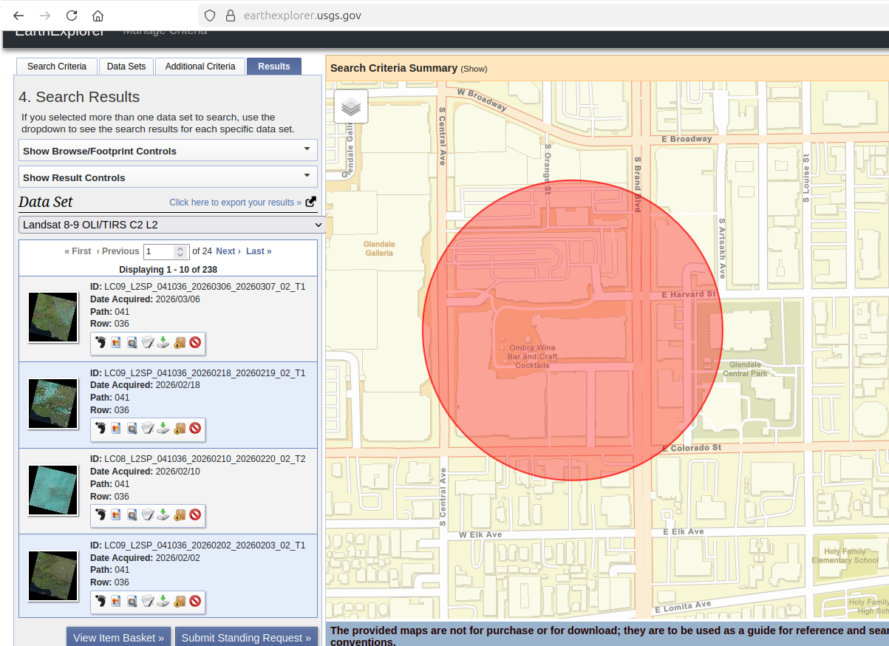
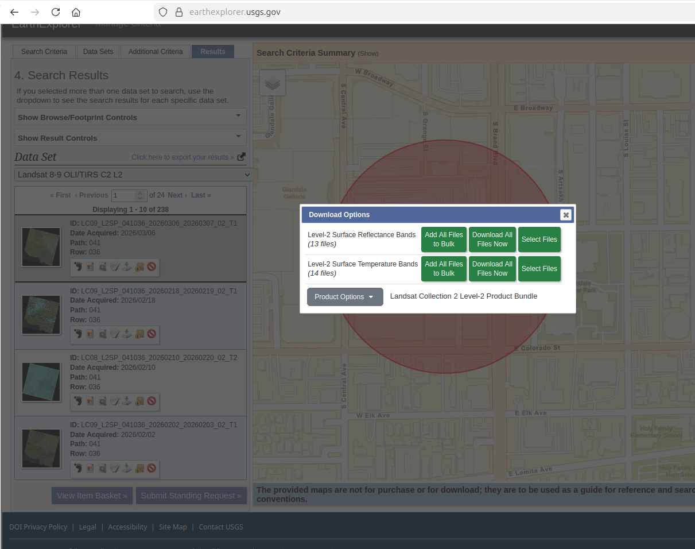
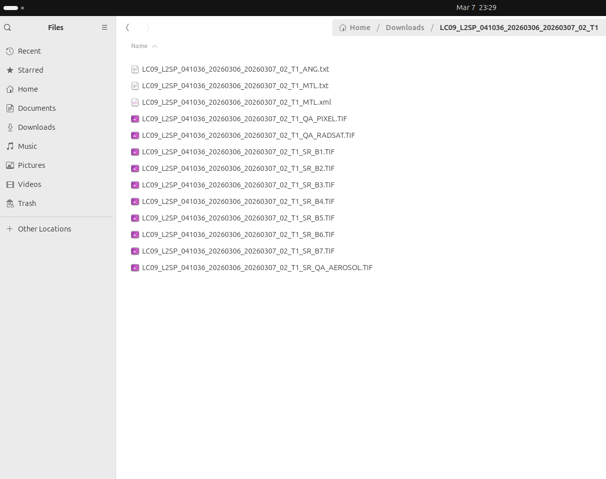
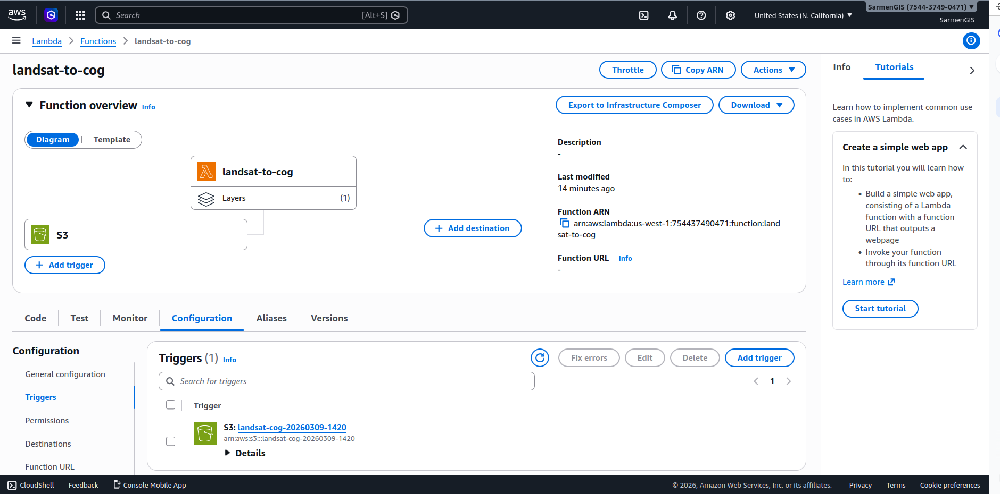
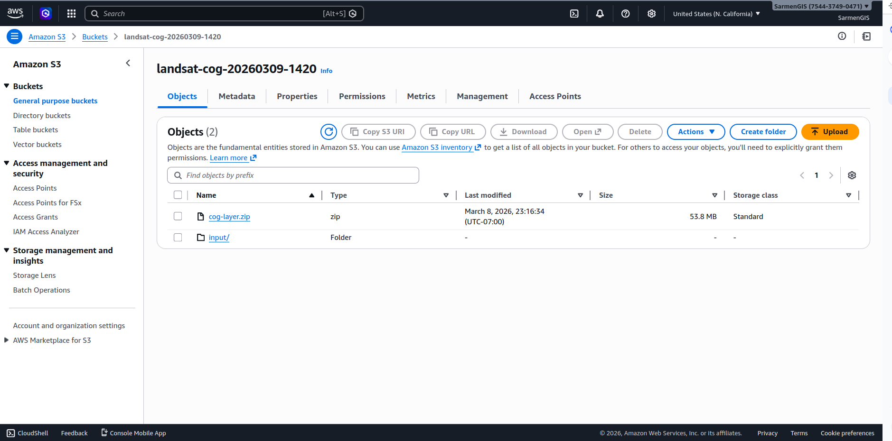
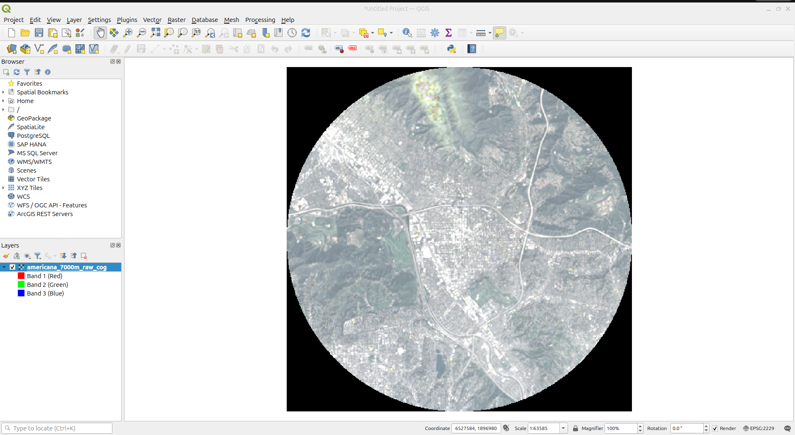

# serverless-aws-lambda-S3-gdal-landsat-COGGeoTIFFs--converter
Serverless GIS pipeline: Local GDAL on Linux handles Landsat preprocessing (CRS analysis, reprojection to EPSG:2229, clipping). AWS Lambda + S3 with rasterio &amp; rio-cogeo libraries convert to COG format. Instant viewing in QGIS. Zero cost - AWS Free Tier.

You can download all files from this Google Drive link: 
<br>
https://drive.google.com/drive/folders/1Y0s3RMcB-PAFf0_EnBr1cAUU0z7uGSDr?usp=sharing
</br>

# 🛰️ Serverless AWS Lambda S3 GDAL Landsat COG GeoTIFF Converter

[](https://aws.amazon.com/lambda/)
[](https://aws.amazon.com/s3/)
[](https://gdal.org/)
[](https://www.python.org/)
[](https://rasterio.readthedocs.io/)
[](https://cogeotiff.github.io/rio-cogeo/)
[](https://www.linux.org/)
[](https://qgis.org/)
[](https://opensource.org/licenses/MIT)

---

## 📋 **Project Description**

This project implements a **cost-optimized hybrid geospatial pipeline** that transforms raw Landsat 9 satellite imagery into Cloud Optimized GeoTIFFs (COGs). The workflow strategically combines **local Linux processing with GDAL** for heavy computational tasks and **serverless AWS services (Lambda + S3)** for automated conversion, resulting in a **100% free-tier-compliant** solution with files ready for instant viewing in QGIS.

## ☁️ **What is a Cloud Optimized GeoTIFF (COG)?**

A **Cloud Optimized GeoTIFF (COG)** is a specialized GeoTIFF file, hosted on HTTP servers, that enables efficient, fast cloud-based workflows by allowing users to access, stream, and process only the specific, required parts of a large raster dataset without downloading the entire file. It uses internal tiling and overviews, making it ideal for cloud storage, web mapping, and GIS applications.

### 🔑 **Key Features and Benefits**

- **Efficient Data Access**: COGs utilize HTTP GET range requests, allowing software to request only the specific pixels needed for a viewport or analysis, significantly reducing network bandwidth and processing time.
- **Internal Tiling**: Unlike traditional raster files, COGs are organized into small, compressed tiles, which allows for fast retrieval of specific geographic areas.
- **Overviews**: They include downsampled, lower-resolution versions of the image (pre-computed thumbnails), enabling rapid visualization at different zoom levels.
- **Backwards Compatibility**: While enhanced for the cloud, COGs are valid GeoTIFFs, ensuring they still work with traditional GIS software.
- **Fast Cloud Access**: They are designed to be streamed directly from object storage (like AWS S3) by tools like QGIS, ArcGIS Pro, or web maps.

### 📊 **Difference from Standard GeoTIFF**

While a normal GeoTIFF stores data sequentially, a COG is organized to allow for **random access**. The structure puts the metadata and "overviews" (lower-resolution images) at the beginning of the file, allowing a reader to instantly understand the structure and fetch only the relevant data tiles.

**Standard GeoTIFF**: Must download entire file to read any part  
**Cloud Optimized GeoTIFF**: Only requests tiles needed for current view

### 🎯 **Why This Matters for This Project**

In this pipeline, we convert a **400 MB Landsat image** into an **884 KB COG** that can be:
- Streamed instantly in QGIS without downloading
- Accessed via web browsers and mapping applications
- Served efficiently from AWS S3 with minimal bandwidth

**Result: 99.8% size reduction with instant cloud access!** 🚀

Using GDAL command-line tools on Linux, we extract RGB bands from Landsat 9 Level-2 Surface Reflectance data downloaded from [USGS EarthExplorer](https://earthexplorer.usgs.gov/). We perform **Coordinate Reference System (CRS) conversion** from the original projection to **California State Plane NAD83 Zone 5 (EPSG:2229)** using `gdalwarp`, which ensures all measurements are in US feet and properly aligned with Southern California mapping standards. The image is then clipped to a **7,000-meter radius (14km diameter) around Americana at Brand in Glendale, California (34.144°N, 118.256°W)** , reducing the file size from gigabytes to approximately 400MB.

The processed GeoTIFF is uploaded to **Amazon S3**, automatically triggering an **AWS Lambda function** written in Python. **Important Note: AWS Lambda does not include GDAL in its standard managed runtimes; it must be provided via Lambda Layers, a custom runtime, or a Docker container."**, so we leveraged pure Python libraries instead. This serverless function uses two powerful **open-source Python libraries**: **[rasterio](https://rasterio.readthedocs.io/)** (which provides Python bindings for GDAL) and **[rio-cogeo](https://cogeotiff.github.io/rio-cogeo/)** (specialized COG creation library).

During development, we encountered compatibility issues with **Python 3.14** as the latest rasterio and rio-cogeo versions hadn't been updated for this runtime. We successfully resolved this by using **Python 3.9**, which has stable, well-tested support for both libraries. The Lambda function downloads the GeoTIFF from S3, converts it to Cloud Optimized GeoTIFF format with proper internal tiling and overviews, and uploads the final product back to S3. The resulting COG is **99.8% smaller** (884KB vs 400MB) and can be streamed instantly in **[QGIS](https://qgis.org/)** or any modern GIS application supporting Cloud Optimized GeoTIFFs.

---

## 🗺️ **Area of Interest Details**

| Parameter | Value |
|-----------|-------|
| **Location** | Americana at Brand, Glendale, California |
| **Latitude** | 34.144° North |
| **Longitude** | 118.256° West |
| **Buffer Radius** | 7,000 meters (7km / 4.35 miles) |
| **Diameter** | 14,000 meters (14km) |
| **CRS** | **NAD83** / California Zone 5 (EPSG:2229) |

---

## 🔧 **Technologies Used**

| Component | Technology | Purpose |
|-----------|------------|---------|
| **Satellite Data** | [Landsat 9](https://www.usgs.gov/landsat-missions) | Source imagery (March 6, 2026) |
| **Local Processing** | [GDAL](https://gdal.org/) on [Linux](https://www.linux.org/) | CRS analysis, reprojection, merging, clipping |
| **CRS Conversion** | `gdalwarp` | Convert to **NAD83** EPSG:2229 |
| **Cloud Storage** | [Amazon S3](https://aws.amazon.com/s3/) | Input/output file storage |
| **Serverless Compute** | [AWS Lambda](https://aws.amazon.com/lambda/) | Automated COG conversion (Python 3.9) |
| **Python Libraries** | [rasterio](https://rasterio.readthedocs.io/), [rio-cogeo](https://cogeotiff.github.io/rio-cogeo/), boto3 | GDAL bindings, COG creation, AWS SDK |
| **GIS Viewer** | [QGIS](https://qgis.org/) | Instant COG visualization |

---

## ⚠️ **Important Technical Notes**

### AWS Lambda + GDAL Challenge
AWS Lambda does **not** natively support GDAL without Docker containers. We circumvented this by using **rasterio** (Python GDAL bindings) which packages the necessary components without requiring system-level GDAL installation.

### Python Version Compatibility
We initially attempted Python 3.14 but encountered compatibility issues because the latest rasterio and rio-cogeo wheels weren't available for this runtime. **Python 3.9** was chosen for its stable, production-ready support for geospatial libraries.

### CRS Details
The target projection is **NAD83 / California Zone 5 (EPSG:2229)** , a CRS optimized for Southern California using US survey feet, based on the **North American Datum 1983**.

---

## 📊 **Performance Metrics**

| Metric | Value |
|--------|-------|
| Original Landsat Scene Size | ~1.2 GB (all bands) |
| Clipped RGB Image (pre-COG) | 400 MB |
| Final Cloud Optimized GeoTIFF | 884 KB |
| Size Reduction | **99.8%** |
| QGIS Load Time | < 3 seconds |
| AWS Lambda Duration | 2.5 minutes |

---

## 💰 **AWS Free Tier Status & Complete Cleanup**

| Service | Free Tier Limit | This Project | Status |
|---------|-----------------|--------------|--------|
| S3 Storage | 5 GB | 400 MB (8%) | ✅ Free |
| Lambda Requests | 1M/month | 1-2 requests | ✅ Free |
| Lambda Compute | 400K GB-seconds | ~100 GB-seconds | ✅ Free |

**Total Cost During Testing: $0.00**

### 🧹 **Post-Project Account Cleanup**

After successfully completing this project and verifying the pipeline works, we performed a **complete and thorough cleanup of all AWS resources** to eliminate any possibility of future charges:

- ✅ Deleted all S3 buckets and objects
- ✅ Removed Lambda functions and all versions
- ✅ Deleted all Lambda layers
- ✅ Removed CloudWatch log groups
- ✅ Deleted IAM roles and policies
- ✅ Verified no remaining resources in any region
- ✅ **Closed the AWS account entirely**

This ensures that even if there were any residual configurations or forgotten resources, no charges could possibly accrue. The project remains fully reproducible using the code in this repository and a new AWS Free Tier account.


### USGS Data Download

<p><em>Figure 1: USGS EarthExplorer website for Landsat data download</em></p>


<p><em>Figure 2: Downloading all Landsat files in a zipped folder</em></p>


<p><em>Figure 3: Extracted Landsat 9 files - 13 total including spectral bands and metadata</em></p>

### AWS Configuration

<p><em>Figure 4: AWS Lambda function configuration with Python 3.9 runtime</em></p>


<p><em>Figure 5: S3 bucket trigger configured for automatic Lambda invocation</em></p>


<p><em>Figure 6: Created S3 buckets for input/output storage</em></p>

### Final Result

<p><em>Figure 7: Cloud Optimized GeoTIFF (884KB) loading instantly in QGIS in under 3 seconds</em></p>

---

## 🚀 **Quick Start**

```bash
# Clone the repository
git clone https://github.com/YOUR_USERNAME/serverless-aws-lambda-S3-gdal-landsat-COGGeoTIFFs--converter.git
cd serverless-aws-lambda-S3-gdal-landsat-COGGeoTIFFs--converter

# Install GDAL on Linux
sudo apt update && sudo apt install -y gdal-bin

# Download all files and scripts from Google Drive link
https://drive.google.com/drive/folders/1Y0s3RMcB-PAFf0_EnBr1cAUU0z7uGSDr?usp=sharing

# Download the final COG
aws s3 cp s3://your-bucket/output/americana_7000m_raw_cog.tif ./

├── scripts/
│   ├── 01_check_crs.sh          # CRS analysis with gdalsrsinfo
│   ├── 02_reproject_rgb.sh       # Reprojection to EPSG:2229 with gdalwarp
│   ├── 03_merge_rgb.sh           # RGB band merging with gdal_merge.py
│   ├── 04_clip_with_buffer.sh    # 7,000m buffer and clipping
│   └── 05_prepare_for_aws.sh     # AWS preparation with free tier verification
├── aws_lambda/
│   └── lambda_function.py        # Python 3.9 Lambda with rasterio & rio-cogeo
├── process_landsat_7000m.sh      # Main local processing script
├── upload_to_aws_7000m.sh        # S3 upload script with verification
├── README.md                      # This file
└── LICENSE                        # MIT License


# Open in QGIS and enjoy instant loading!


